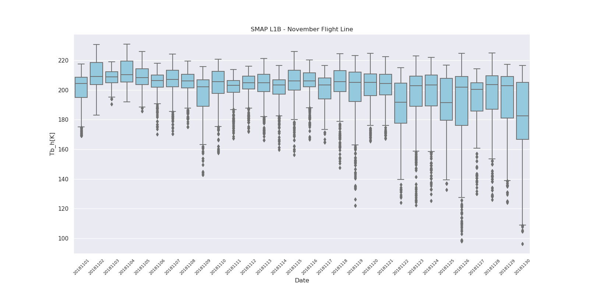

# CSV-Pandas

Different graphs obtained using dataset stored in .CSV files are presented. The files are read using Pandas and are graphed through the Seaborn library and Pandas grouping operations.

Correlation matrix plot: 

  
 

Temporal evolution plot: 

  
 

Boxplot chart:

  
 

Plot mean and standard deviation:

  
 

Dependences:

    python - Pandas
    python - NumPy
    python - Matplolib
    python - Numpy
    python - Seaborn
    python - Scipy - stats
    python - shapefile

Pages source:
 https://seaborn.pydata.org/
